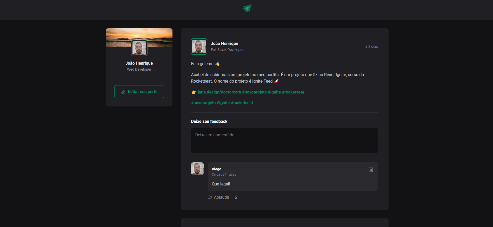
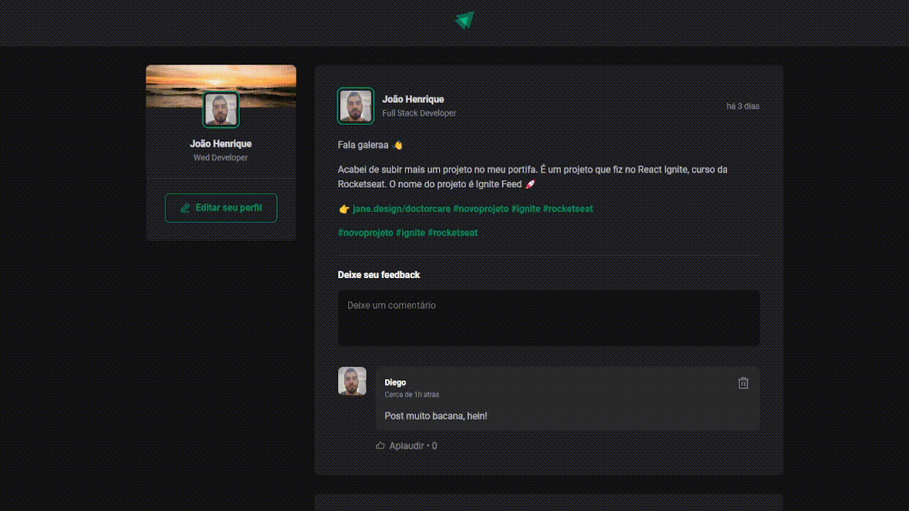

<h1 align="center" style="font-weight: bold;">Ignite Feed 💻</h1>

This project explores fundamental React JS concepts, including components, props, state management, component communication, and callbacks via props. Developed during the Rocketseat Ignite course, it offers a solid understanding of React's core principles. The project uses React, Git, Vite, Phosphor React, and date-fns.

<p align="center">
    
</p>

## 💻 | Technologies

<div id="technology" style="display: inline_block">
  
  
  
  
  
  
</div>

## 👨‍💻 | Running Project

Here you list all prerequisites necessary for running your project.

- [NodeJS](https://nodejs.org/pt)
- [Git](https://git-scm.com/)

Clone this repository

```bash
  git clone https://github.com/joaohenriquefernandes/ignite-feed.git
  cd ignite-feed
```

Dependency installs

```bash
  npm install
```

Starting project

```bash
  npm run dev
```

## 📺 | Preview



## 📍 | Routes

| Method   | Route                            | Description                |
| -------- | -------------------------------- | -------------------------- |
| `GET`    | `/`                              | Home page                  |

## 🙋🏽‍♂️ | Colaborators

<table>
  <tr>
    <td align="center">
      <a href="#">
        <br>
        <sub>
          <b>João Henrique Fernandes</b>
        </sub>
      </a>
    </td>
  </tr>
</table>
